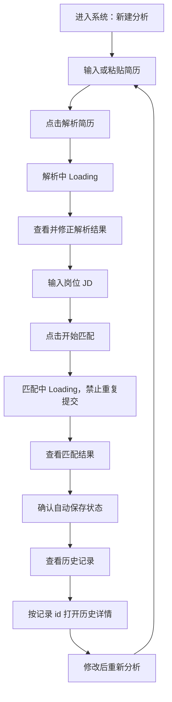

# 用户流程：AI 简历诊断与岗位匹配系统

日期：2026-09-08  
负责人：成员 D（结果体验、质量与展示）

## 1. 文档状态与范围

本文定义 MVP 的新建分析、匹配结果、历史记录和重新分析流程，不扩展登录注册、管理员后台、市场分析等功能。

本轮已完成 Result、History mock 页面和新建分析输入原型，并已整合到 `JD_select-main/frontend/`。当前真实后端仅有 `GET /api/health`；简历解析、岗位匹配、保存和历史接口尚未完成。因此，下述完整流程是目标体验，不代表真实业务联调已经通过。

页面中的固定结果始终标识为“业务数据为本地示例 · 未调用匹配接口 · 未保存”。健康检查成功只代表 FastAPI 可以连接。

## 2. 主流程

## 3. 页面、操作、反馈与去向

| 用户当前在哪里 | 用户操作 | 系统反馈 | 下一步 |
|---|---|---|---|
| 新建分析／初始状态 | 进入系统 | 显示简历输入、解析结果、JD 输入和提交入口 | 输入简历 |
| 新建分析／简历输入 | 粘贴或编辑简历文本 | 保留输入；清除已修复的空输入提示；原文改变后旧解析结果标记为待更新 | 解析简历 |
| 新建分析／解析中 | 点击“解析简历” | 显示“正在解析简历…”；禁用解析按钮并阻止重复请求 | 成功进入解析结果；失败留在原页 |
| 新建分析／解析结果 | 查看教育、经历、项目、技能并修正 | 展示真实解析结构；未识别区块显示可读提示；允许确认修正 | 输入 JD |
| 新建分析／JD 输入 | 输入岗位职责和要求 | 保留内容；空白错误与 JD 输入框关联 | 开始匹配 |
| 新建分析／匹配中 | 点击“开始匹配” | 校验简历与 JD；显示“正在分析匹配情况…”；按钮禁用，事件处理同时拦截重复提交 | 成功进入结果；失败留在当前页面 |
| 匹配结果／成功 | 查看岗位、总分、分项、技能、建议和证据 | 展示本次服务端响应；缺失字段明确提示；显示评分局限 | 查看历史或重新分析 |
| 匹配结果／保存状态 | 无需额外点击 | 仅在服务端确认后显示“已保存”；未确认或失败时不能假装已保存 | 成功可进入历史；失败仍可查看结果 |
| 历史记录／列表 | 打开历史页面 | 显示最近记录的岗位名称、匹配分和创建时间 | 点击“查看详情” |
| 历史详情／加载 | 打开某条记录 | 使用服务端返回的字符串 `id` 查询；不显示其他记录的旧分数 | 成功、失败或不存在状态 |
| 历史详情／成功 | 点击“修改后重新分析” | 仅带入详情中实际可用的原文；缺少原文时提示重新粘贴 | 返回新建分析 |
| 新建分析／重新分析 | 修改简历或 JD 后再次提交 | 简历改变后重新解析并确认；生成新记录，不覆盖旧评分快照 | 新结果及新 id |

“查看结果 → 自动保存”是用户感知顺序。若正式 `POST /api/matches` 同时负责计算和保存，前端不应再重复调用另一个创建接口。

## 4. 异常流程

| 异常 | 系统行为与提示 | 恢复路径 |
|---|---|---|
| 简历为空 | trim 后为空时提示“请先输入简历内容”；不发送解析或匹配请求；焦点定位简历框 | 输入简历后重试 |
| JD 为空 | 提示“请先输入岗位 JD”；不发送匹配请求；保留有效简历 | 输入 JD 后重试 |
| 简历解析失败 | 显示“简历解析失败，请稍后重试”；保留原文并恢复按钮；不展示过期结果 | 原页重新解析 |
| 匹配请求失败 | 显示可读错误；保留简历、JD 和修正内容；不显示伪造分数或“已保存” | 原页手动重试 |
| 匹配处理中重复点击 | 同一在途操作最多发送一个请求；按钮禁用，事件处理也检查在途锁 | 请求结束后才允许再次提交 |
| 历史记录为空 | 请求成功且记录数为 0 时显示“还没有分析记录”，提供“新建分析”入口 | 进入新建分析 |
| 历史列表读取失败 | 显示“历史记录加载失败，请重试”，不得伪装为空历史 | 重试列表 |
| 历史详情不存在 | 明确提示“这条分析记录不存在”；不回退到数组第一项或显示旧详情 | 返回历史或新建分析 |
| 历史详情读取失败 | 显示“详情加载失败，请重试”；保留当前 id | 重试相同 id |
| 可选内容为空 | 分别显示“暂无匹配技能”“未发现缺失技能”“暂无改进建议”“暂未提供评分证据” | 继续查看其他内容 |

网络超时后，服务端可能已经保存记录。跨请求幂等和重试语义需要 A/C 确认；前端防重复点击只能约束当前在途操作。

## 5. 当前已实现的可操作路径

当前整合版提供：

`新建分析输入原型 → 打开固定结果示例 → 历史示例 → 按 id 打开详情 → 修改后重新分析返回输入原型`

- 简历和 JD 输入仅保留在 React 内存中，刷新后清空。
- “填入合成示例”会展示明确标注的预设结构，并非解析结果。
- “解析简历”和“开始匹配”按钮禁用并标记为待接入。
- Result/History 支持 normal、loading、error、empty；详情支持不存在状态。
- 唯一真实请求是用户手动点击“检查后端连接”时调用 `/api/health`。

## 6. 待 A/B/C/D 联调确认

1. B/C/A：人工修正后的结构化简历如何传给匹配服务，避免只传原文而丢失修正。
2. A/C：匹配成功与保存成功的关系、事务边界、网络重试与去重语义。
3. A：历史列表封装、详情 id、`created_at` 时区、错误结构、详情是否返回重新分析所需原文。
4. C：分项范围、评分证据结构、`suggestions` 是字符串还是对象、算法版本规则。
5. D：在真实契约稳定后用现有组件 props 接入数据，并重新执行完整验收。

