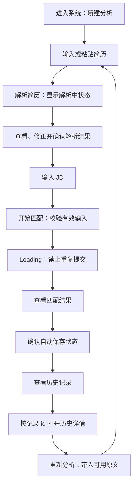

# 用户流程（D 侧设计草稿）

日期：2026-09-09。范围：MVP 新建分析、结果、历史记录。

状态：已并入 JD_select-main；已读取原有 docs/collaboration.md、README、MVP_TASK_PLAN、handoff 和源码，并运行 OpenAPI 检查。当前真实后端仅有 /api/health；Result/History 为 mock，新建分析已实现本地校验、Loading、失败、重试和防重复提交。以下主流程仍是目标体验，不代表解析、匹配、保存或真实联调已经完成。

依据优先级：本次用户指令 > MVP_TASK_PLAN.md 的职责与 MVP 范围。README.md、handoff.md 提供附件中的启动及历史背景；a4-integration-checklist.md 仅提供待确认事项，其中的合并、推送、联调建议不是今天的执行指令。

## 1. 主流程

“查看结果 → 自动保存”是用户感知顺序，不要求前端另发一次保存请求。若正式契约由匹配请求同时计算和保存，则成功响应及服务端确认代表已保存；D 不重复调用存储接口。保存状态未确认时不得显示“已保存”。当前演示始终显示“业务数据为本地示例 · 未调用匹配接口 · 未保存”；仅“检查后端连接”调用真实健康接口。

当前可操作路径：新建分析 → 填写简历/JD → 选择本地成功或失败模拟 → 查看 Loading、错误与重试 → 成功后打开固定结果示例 → 历史示例列表 → 按 id 打开详情 → 修改后重新分析返回输入页。输入只保留在 React 内存中，刷新后清空；固定结果与输入无关；真实解析按钮禁用，本地匹配模拟不调用 API。见 [测试报告](test-report.md)。

## 2. 每一步的页面、操作、反馈和去向

| 当前页面/状态 | 用户操作 | 系统反馈 | 下一步 |
|---|---|---|---|
| 新建分析／初始 | 进入系统 | 展示简历输入、JD 输入、解析及匹配入口；输入提示可见 | 留在新建分析 |
| 新建分析／编辑简历 | 粘贴或输入文本 | 保留输入；清除已修复的字段错误；文本修改后旧解析结果标记为待更新 | 解析简历 |
| 新建分析／解析中 | 点击“解析简历” | 显示“正在解析简历…”；锁定解析按钮，防止重复请求 | 成功进入解析结果区；失败保留文本 |
| 新建分析／解析结果 | 查看教育、经历、项目、技能并修正 | 展示 B 返回的实际结构；未提取的区块显示“未识别，请补充”；支持确认修正 | JD 输入区 |
| 新建分析／JD 编辑 | 输入或粘贴 JD | 保留输入；空白校验反馈与 JD 关联 | 开始匹配 |
| 新建分析／可提交 | 点击“开始匹配” | 对简历与 JD 去首尾空白后校验；使用本次确认后的有效输入 | 输入不合法留在原页；合法进入 Loading |
| 新建分析／匹配中 | 等待 | 文本提示“正在分析匹配情况…”；按钮禁用，处理函数也阻止重复进入；冻结本次提交内容，不用虚构进度百分比 | 成功进入结果；失败留在输入页 |
| 结果／成功 | 查看岗位、总分、分项、技能、建议和依据 | 展示本次响应；缺失证据明确说明；显示评分局限说明 | 查看历史或重新分析 |
| 结果／保存状态 | 无需额外点击 | 仅在服务端确认后显示“已保存”；保存失败显示可读提示，不假装历史已存在 | 保存成功后可到历史；失败可继续阅读结果 |
| 历史／列表 | 点击“历史记录” | 展示最近记录的岗位名、分数、时间和详情入口 | 点击某条“查看详情” |
| 历史详情／加载中 | 打开某条记录 | 按服务端返回的字符串 id 查询对应记录；加载状态不显示其他记录的旧分数 | 详情成功、失败或不存在 |
| 历史详情／成功 | 点击“修改后重新分析” | 仅使用当前详情实际可用的原文预填；缺少原文则提示重新粘贴；旧记录保持快照 | 新建分析 |
| 新建分析／再次编辑 | 修改简历或 JD 并重新分析 | 简历改变后需要重新解析/确认；匹配生成新记录，不覆盖旧评分 | 新结果及其新 id |

## 3. 异常与恢复

| 当前位置 / 异常 | 触发操作 | 可读反馈和系统行为 | 恢复与去向 |
|---|---|---|---|
| 新建分析／简历为空 | 空字符串、空格或换行输入下解析或匹配 | “请先输入简历内容”；不发请求；提示关联简历框，焦点定位该框 | 输入简历后重新操作 |
| 新建分析／JD 为空 | 有简历但 JD 为空时开始匹配 | “请先输入岗位 JD”；不发匹配请求；焦点定位 JD | 输入 JD 后重试 |
| 新建分析／解析失败 | 解析请求网络或服务异常 | “简历解析失败，请稍后重试”；保留文本，恢复按钮，禁止把过期结果当作新解析结果 | 原页重新解析 |
| 新建分析／匹配请求失败 | 网络中断、超时或服务返回错误 | 展示可读错误；保留简历、JD 与修正内容；恢复按钮；不显示伪造评分 | 原页手动重试 |
| 新建分析／重复点击 | 匹配处理中连续点击、按 Enter 或混合触发 | 同一次在途操作最多发送一个请求；按钮禁用并有“分析中”文本 | 等待成功或失败后才可再次提交 |
| 结果／保存未确认或失败 | 匹配结果可见但保存状态未确认 | “保存状态未确认”或服务端明确的失败提示；不得显示“已保存” | 保留结果；恢复方案待 A/C 契约明确，D 不自动重复创建 |
| 历史／空列表 | 成功响应且记录数为 0 | “还没有分析记录”，提供“新建分析”入口；不展示假数据或白屏 | 跳到新建分析 |
| 历史／读取失败 | 列表请求失败 | “历史记录加载失败，请重试”；与空历史区分 | 点击重试仍停留历史 |
| 历史详情／不存在 | 访问不存在的 id 或收到明确不存在响应 | “这条分析记录不存在”；不显示列表第一条，也不将普通网络错误当作不存在 | 返回历史或新建分析 |
| 历史详情／读取失败 | 网络或服务器异常 | “详情加载失败，请重试”；保留当前 id | 重试相同 id 或返回历史 |
| 结果／可选内容缺失 | 无建议、无匹配技能或未返回证据 | 各区块分别显示“暂无建议”“暂无匹配技能”“暂未提供评分证据”；0 分仍是有效结果 | 正常阅读其他信息 |

匹配请求因网络中断而失败时，服务端可能已经保存。后续重试和去重机制由 A/C 确认；前端防重复点击只解决当前在途提交，不宣称提供跨请求幂等性。

## 4. 状态与可访问性约定

- 页面至少区分 idle / loading / success / error / empty；详情额外区分 not-found。状态名仅为前端设计术语，不是新增 API 字段。
- 解析 Loading 和匹配 Loading 使用不同文案；异步反馈通过可访问状态区提示，错误与字段关联；颜色不是唯一反馈。
- 页面切换后更新标题并将焦点置于主标题；加载结束后能用键盘继续操作。错误时保留输入，避免要求重新粘贴。
- 从结果返回编辑与从历史进入详情应有清楚的页面标题和返回入口；不扩展登录、注册、管理员后台或市场分析。

## 5. 待 A/B/C/D 联调确认

1. **B/C/A：人工修正输入**。附件匹配请求仅含 resume_text / jd_text / job_title，尚未约定修正后的结构化字段如何参与评分。D 先定义体验，不添加请求字段，也不静默丢弃修正。
2. **A/C：保存语义**。附件计划匹配接口计算并保存；须确认真实成功响应、事务失败与网络重试策略。POST /api/analysis-records 不能作为真实匹配接口替代品。
3. **A：历史契约**。核对实际列表封装、详情 id、created_at 时区、原文可用性与错误结构；附件所述 items/total/limit/offset、UTC 和 error.code/message/details 尚未经本地源码核验。
4. **C：证据与建议**。核对实际证据字段、suggestions 元素类型和 score_breakdown 规则；缺少证据时仅展示缺失提示。
5. **B/D：页面接入**。新建分析中的简历解析与编辑归 B；D 的 JD、提交状态和结果入口需在已有组件上接入，今天不重写 B 模块。
